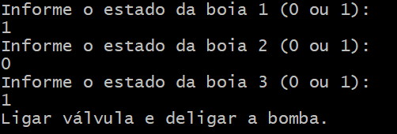

# FuncionamentodoReservatorio

## O que foi utilizado:

- ***Linguagem de programação:*** C#

- ***Ambiente de desenvolvimento:*** Virtual Studio Code

## Etapas Implementadas

1. Declaração de Variáveis:

- ***boia1, boia2, boia3:*** Inteiros que armazenam o estado das três boias.

- ***valvulaLigada, bombaLigada:*** Variáveis booleanas que representam o estado da válvula e da bomba. Embora sejam declaradas, não são utilizadas no controle.

2. Entrada de Dados:

O usuário é solicitado a informar o estado de cada boia através do console (Console.ReadLine()).

3. Lógica Condicional:

Através de uma série de condicionais if-else, o sistema verifica os estados das boias e executa ações como ligar ou desligar a válvula e a bomba, ou relatar falhas no sistema. Porém, existem redundâncias nos condicionais, como o uso excessivo do operador || (OR), que acaba gerando resultados incorretos em algumas situações.

## Backlog

1. Correção da Lógica de Decisão:

A lógica de controle possui falhas, especialmente nas combinações de boia1, boia2, e boia3. Deveria ser usado o operador && (AND) para verificar se todas as condições são atendidas corretamente.

2. Utilização das Variáveis Booleanas:

As variáveis valvulaLigada e bombaLigada são declaradas, mas nunca utilizadas. Elas deveriam ser usadas para refletir o estado final dos componentes.

3. Validação da Entrada:

Não há validação das entradas do usuário. É importante garantir que o valor inserido seja 0 ou 1 para evitar entradas inválidas.

4. Organização do Código:

Melhorar a organização do código eliminando redundâncias nas condições e utilizando uma abordagem mais clara.

## Conclusão

O código tem o objetivo de simular o controle de nível de um sistema de boias, válvula e bomba, mas possui erros lógicos e redundâncias que devem ser corrigidos para funcionar corretamente. Além disso, a funcionalidade das variáveis booleanas não está implementada, e o tratamento de entradas precisa ser aprimorado.